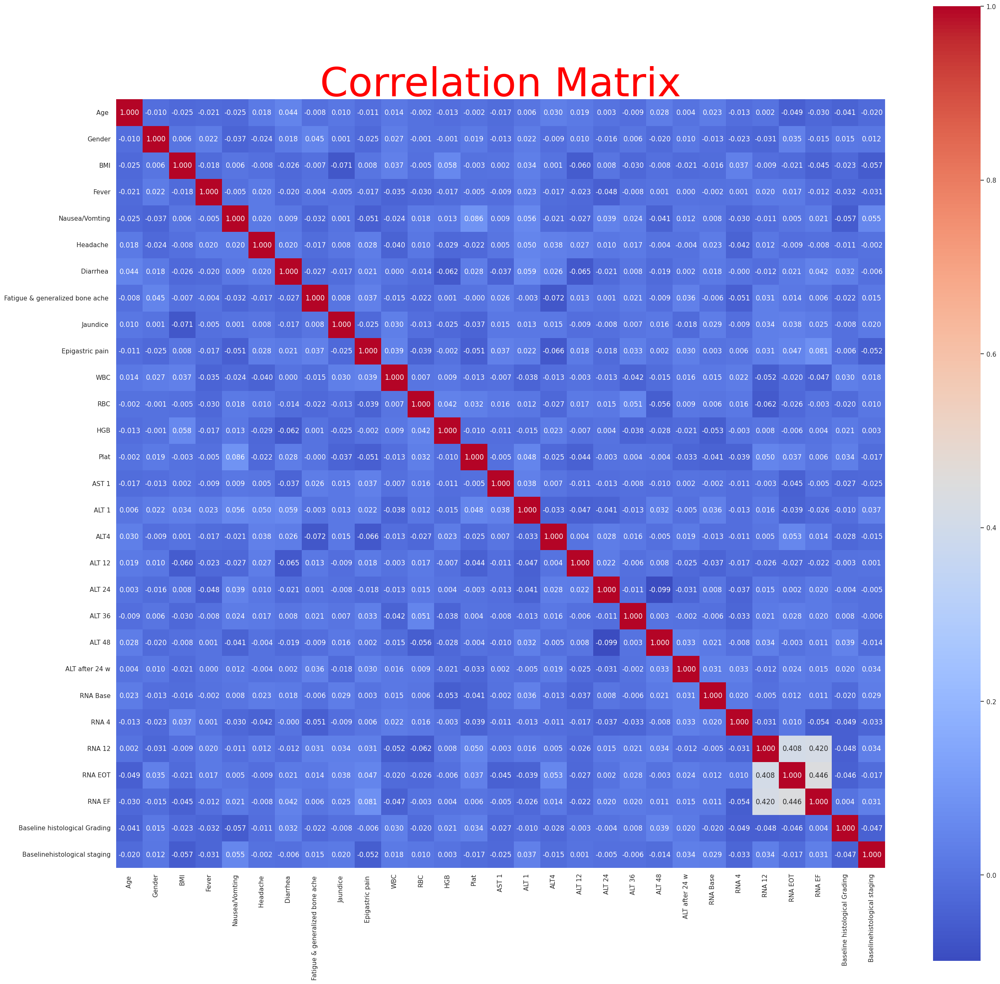
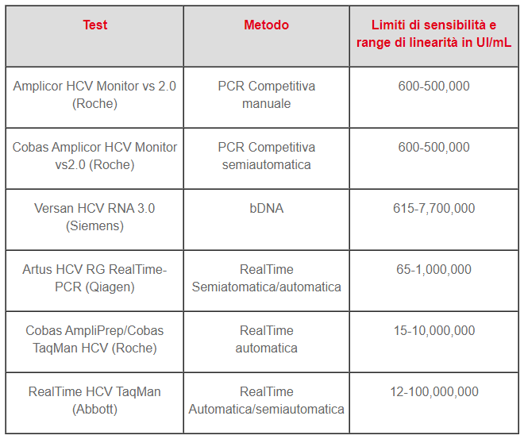

# Report pn RNA features and transaminasis features

Dall'esplorazione dei dati non si sono notate forti correllazioni tra le features del data set di nostro interesse tutta via risulta una modesta correlazione tra 3 features inerenti a test riguardanti l'RNA-HCV il quale risulta essere un test che monitora l'attività di sintesi del virus dell'epatite C quando infetta un idividuo e inizia a usare l'ospite per replicare il suo RNA e riprodursi. Per chiarezza dettagliamo le features del data set che riguardano tali test e le analizzeremo alla luce delle informazioni di partenza e di quelle ricavate dalla business understanding e dalla data exploration and visualization che abbiamo eseguito sul dataset e su delle sue proiezioni. 

  

## Feature table analysis

Iniziamo mostrando la tipologia di dati con i quali stiamo lavorando, questi rappresentano solo una proizione dell'intero dataset inerente le feature riguardanti i test effettuati sul 
RNA-HCV.

|Colonna|Tipo|
|---|---|
|RNA Base|int64|
|RNA 4|int64|
|RNA 12|int64|
|RNA EOT|int64|
|RNA EF|int64|
|Baselinehistological staging|int64|

Queste colonne rappresentano una scansione fatta a varie periodi del test che viene ad essere ripetuto nel tempo in particolare il primo test effettuato è RNA Base che rappresenta la prima valutazione fatta nel momento in cui il paziente riceve attenzione medica per le problematiche dovute a infezione del virus HCV. Il test comproba in caso di positività il contatto con il virus e da questo momento partono i trattamenti basati su antivirali in particolare basati su antivirali orali della famiglia oral sofosbuvir-based. Dopo l'inizio del trattamento il paziente viene monitorato con lo stesso test a distanza di 4 settimane, 12 settimane dall'inizio, a fine del trattamento con antivirali. Per quanto riguarda RNA EF dalle ricerche effettuate non si riesce a trovare un giusto significato a tale test nella letteratura scientifica consultata non sembra esistere un tale test esiste però il fattore di allungamento ovvero un fattore che inibisce o protrae a seconda che sia attivo o meno la sintesi del virus dell'epatite C. Nonostante queste informazioni ricavate non vi è certezza del dato come non vi è certezza che il test ritrovato nella letteratura scientifica sia il test che venga abbraviato con la sigla RNA EF, per tali ragioni si dovrebbe procedere al consulto con un esperto del dominio come un epatologo oppure un endocrinologo. In base a queste motivazioni decideremo a seguito se mantenere tale attributo o eliminarlo per l'addestramento del nostro modello di predizione.

  

## Evidence based on correlation matrix
 
Dallo studio della correlazione delle feature ci è riscontrata una modesta correlazione in particolare tra il test RNA-HCV eseguito a distanza di 12 settimane, quello eseguito a fine del trattamento e quello sui quali abbiamo poche informazioni desccrittive a riguardo. Riportiamo la matrice di correlazione e in seguito mostreremo le successive analisi svoltte:

 

Dopo aver notato questa correlazione sono state fatte ricerche a riguardo dei test che monitorano l'attività di sintesi del HCV nel organismo umano e abbiamo inanzitutto capito che esistono differenti tipi di test in letteratura scientifica alcuni dei quali non risultano congrui con i valori che ritroviamo restano pertanto due possibili candidati dei test utilizzati e nonostante non sia reso chiaro in modo evidente dallo studio fatto da questi medici Egiziani sembrerebbe che il test utilizzato sia il RealTime HCV TaqMan Abbott di seguito riportiamo la tabella dei test i valori di virulenza correlati e il link alle fonti scientifiche tratte:

[https://www.epatitec.info/Calibrazione test RNA-hcv](https://www.epatitec.info/strumenti-informativi/interviste-specialisti/hcv-rna-quantificare-virus-sangue#:~:text=Non%20esistono%20in%20assoluto%20soglie,alti%20ma%20sono%20considerazioni%20arbitrarie.)

Queste ricerche fatte portano alla luce 3 problematiche maggiori:

- Il valore minimo di 5 nel data set non rispecchia il range della tabella citata
- applicare un  processo di data reduction su feature non del tutto correlate
- prendere una decisione sul utilizzo o meno di RNA EF

  

## Dealing with minimal possible error range

Per capire in che modo il problema affetti il data set sono stati visualizzate le proiezioni di interesse sul RNA e in particolare sono stati creati 2 file excel che permettono un analisi agevole e visuale delle problematiche e dei pazienti che ricadono in tale situazione. Analizzando il campione su 386 pazienbti che presentano almeno un  valore tra RNA 12, RNA EOT o RNA EF uguale a 5.0 solo 5 risultano apparentemente anomali ovvero analizzanto il file risulta che il test eseguito a 12 settimane è basso ovvero pari a 5.0 e successivamente il valore al successivo test di fine trattamento risale a valori alti questo potrebbe essere dovuto o ad una seconda esposizione al virus oppure a errore di misurazione del test il quale sembra più probabile per tali ragioni nostante gli esempi che ricadano sotto tali condizioni siano esegui andremo a sostituire tale valore con la media delle osservazioni fatti sul intero data set inerenti a tale caratteristica. Per i 381 pazienti che invece segnalano un valore pari a 5.0 su RNA 12, RNA  EOT e RNA EF ci sono buone possibilità che il trattamento con l'antivirale orale abbia sortito l'effetto desiderato per cui non si considerano come errori e per tale ragione verrano semplicemente sostituiti con un valore di riferimente che rientri nel range del test preccedentemente citato assumendo un valore tale da non evincere la positività del test per la sintesi del virus HCV.

  

## Data reduction strategy plan

Per cercare di gestire la course of dimensionalty e quindi tenere sotto controllo la dimensionalità del dataset e cercare di contenere quella che sarà la complessità del modello quando andremo ad addestrarlo su tali tali vogliamo applicare la PCA o la FA per cercare di ridurre l'intero set di feature che controllano i valori del sintesi del virus in una sola feature questo è motivato dal supporto della correlazione tra le feeature, ma anche dalla tipologia di dato che stiamo cercando di fondere in un solo dato riassuntivo. Questo quindi non andrà ad impattare sulla explainability del modello, ma non a tal punto da ritrovare un nesso causuale tra il monitoraggio dei test e la degeneragione della fibrosi.Cio nonostante i dettagli sul processo di data reduction sarà discussi a parte a decisione conclusa e non si esclude l'ipotesi di testa più modelli sotto diverse condizini di addestramento per poi effettuare un analisi comparativa.

  

## RNF EF description e understanding

Per quanto riguarda l'RNA EF saranno condotte ulteriori ricerche le quali se non dovessero portare a chiarire il significato di tale test porterranno alla non presa in considerazione di tale attributo per l'addestramento del modello.

  

## Summarization for dataset projection 

  

### link utili:
[antivirali usati per il trattamento](https://www.ncbi.nlm.nih.gov/pmc/articles/PMC5330612/)

[info](https://brieflands.com/articles/hepatmon-15279.html)