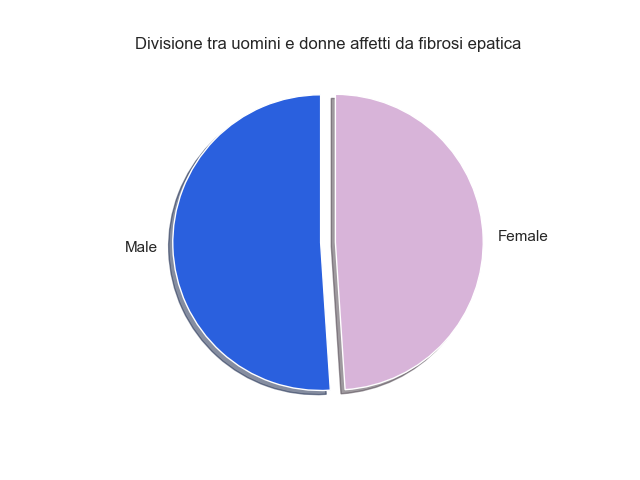
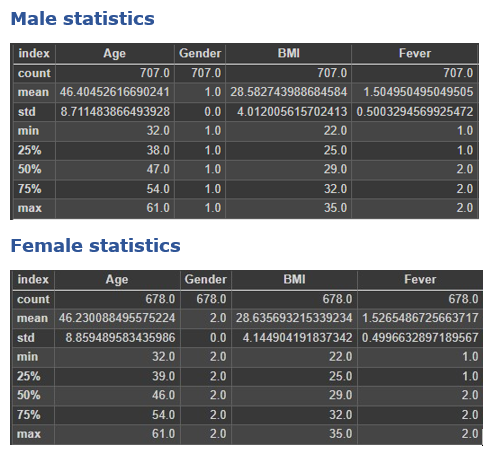
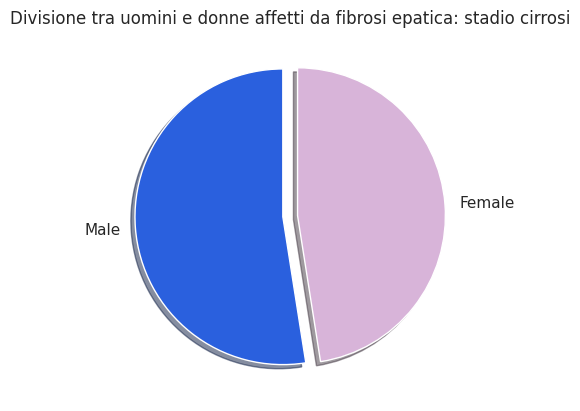
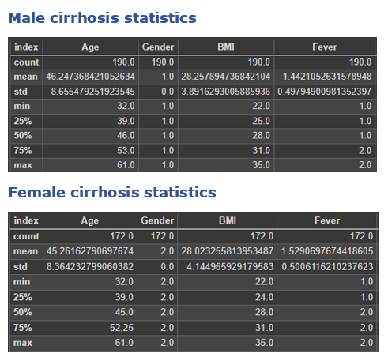
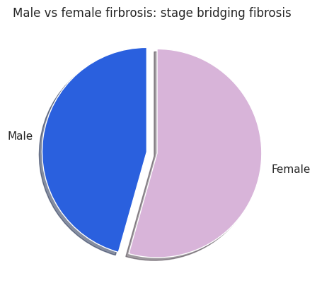
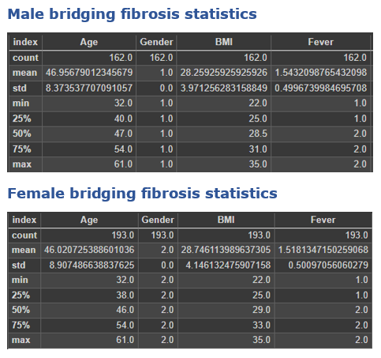
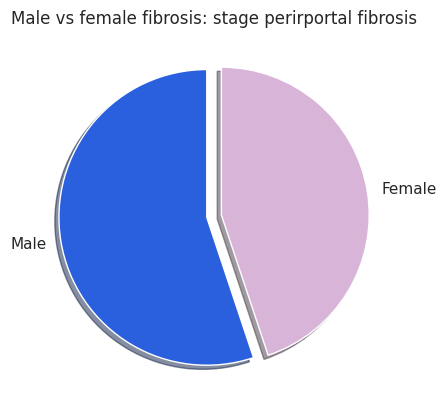
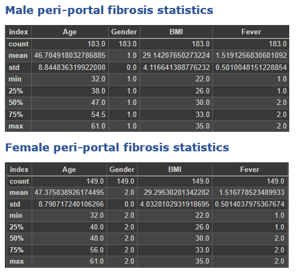
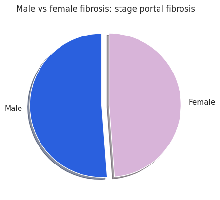
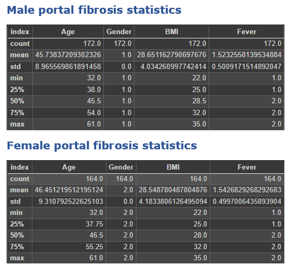

# Report on male vs female data visualization, summarise and exploration

L'esplorazione del dataset ha permesso di capire che gli esmpi a disposizione sono equamente distributi se consideriamo la classe gender la quale non è il nostro target, ma ci permette di acquisire conoscenza e famigliarizzare con i dati. Sono stati effettuati una serie di plot di tipo grafico a torta il quale è stato scelto per la sua forza espressiva visto che volevamo mettere in evidenza se ci fossere delle disparità che affliggessero maggiormente una delle due classi a discapito dell'altra. Dall'analisi fatte sono emersi poche percentuali di sbilanciamento  le quali assumono un lieve sbilanciamento se prendiamo la divisione fatta per pazienti in base al sesso e allo stadio della fibrosi. Di seguito riportiamo gli studi fatti tramite i grafici.

## General situation male vs female

Visualizziamo la situazione generale del nostro dataset dei patienti fibrotici per sesso:

Sul intero dataset la problematica si distribuisce con equità.

## Cirrhosis stage focus on male vs female
Andesso ripetiamo la precedente  analisi focalizzandosi sui pazienti che si trovano nello stadio cirrotico e come la cirrosi si divida per sesso:

Dall'analisi condotta possiamo notare come la cirrosi si distribuisca equamente con una lieve pendenza verso il sesso maschile.

## Bridging fibrosis stage on male vs female

Verifichiamo come si distribuisce lo stadio della bridging fibrosis rispetto al sesso dei pazienti:

Analizzando il grafico a torta si evince uno sbilanciamente più notevole rispetto ai precedenti con una porziane di donne affetta maggiormente rispetto agli uomini del campione raccolto. Lo sbilanciamento e di 31 casi in più sulle donne rispetto agli uomini con una percentuale del 9% di affezione maggiorittaria della patologia. 

## Peri-portal fibrosis stage on male vs female

Passiamo ad analizzare la distribuzione dello stadio peri-portal sul campione e come esso si adatti al sesso:

Anche in questo caso l'analisi condotta sul campione mette in luce un lieve sbilaciamento questa volta però a favore degli uomini sulle donne. Quindi lo stadio della peri-portal fibrosis sembra colpire maggiormente gli uomini rispetto alle donne, in particolare la porzione a favore dei degli uomini è di 34 casi in più rispetto alle donne tale porzione corrisponde a circa 9% dell'intero campione. 

## Portal fibrosis on male vs female

Procediamo all'analisi del quarto cammpione per capire come la portal-fibrosis si distribuisce secondo il sesso:

Dall'analisi delle statistiche e dalla visualizzazione del grafico a torta è possibile evincera una situazione quasi perfettamente bilanciata senza alcuna preferenza di incidenza rispetto al sesso del paziente.

## Conclusioni

Le analisi condotte ci hanno permesso di capire come la patologia si estanda rispetto al sesso e se pur in alcuni stadi sembra che la patologia protenda verso uno o l'altro sesso i risultati ottenuti potrebbero essere dovuti al bias del campione selezionato. Consideriamo inoltre che gli stadi analizzati, con il tempo tendono a peggiorare nonostante vengano trattati repentinamente con i dovuti trattamenti farmacologici e attenzione medico-sanitaria, possiamo concludere che i pazienti che hanno evidenziato lo sbilanciamento in una categoria con la cronicizzazione della patologia ristabiliranno le proporzioni. Per cui dallo studio fatto si evince che non ci sia una marcata propenzione della malattia verso uno dei due sessi. Tuttavia dalle ricerche svolte si riportano 3 link che danno informazioni dettagliate sulla patologia e sulla sua evoluzione nonchè sulla distribuzione che essa assume in Egitto, in particolare il primo link afferma un incidenza della fibrosi in pazienti di sesso maschi sottolineando il nesso causale con le abitudini di vita e forte consumo di alcolici.

### link utili per la comprensione della patologia e della sua distribuzione

