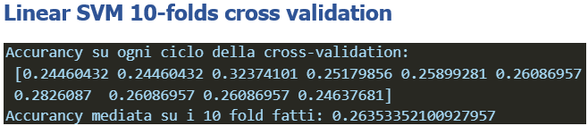

# Report on training 

## First plan comparative analysis 

Dopo aver concluso le precedenti fasi di bussiness understanding, data understanding, data preparation abbiamo finalmente effettuato l'addestramento del modello di classificazione per il task multi-class che ci eravamo preposti dopo aver completato la fase di bussiness e data understanding. L'addestramento è stato ostico e sicuramente non ci aspettavamo dalle analisi iniziali che potesse risultare così complicato come si è riscontrato in corso di effettivo addestramento. Siamo partiti dal voler compiere un analisi comparativa che vedesse a comfronto un modello di classificazione basato su di un albero decisionale, un modello che si basasse sul framework Bayesiano e infine un modello di addestrato tramite il processo dell'ensemble learning, il quale prevede di addestrare più modelli e una volta addestrati utilizzare una funzione di aggregazione capace di sintetizzare i risultati riportati da questi modelli in un unico risultato finale. Quindi il piano di addestramento iniziale prevedeva un'analisi comparativa tra i seguenti 3 modelli:

      1. Decision Tree model C4.5
      2. Gaussin Naive Bayes
      3. Random Forest
     

Con questa idea di partezza abbia utilizzato python 3.0 e la libreria di scikitlearn per importare ed anadare ad addestrare i modelli sopra elencati. Le fasi inizialii di training non si sono concluse con successo i modelli addestrati riportavano scarsi risultati sicuramente risultati che non avrebbeero risolto il problema che ci siamo pre posti. Conseguentemente a risultati di performance scadenti abbiamo deciso di rielaborare il piano iniziale e per prima cosa ci siamo posti di analizzare il **lower bound** del problema, il quale è stato identificato con la moda. In seguito il nostro primo obiettivo è stato quello di riuscire a battere questo stimatore che risulta essere uno stimatore zero-effort che ci viene dato dalla teoria statistica e in seguito in caso di successo avvremmo cercato di definire un **uper bound** con il quale ci saremmo ritenuti soddisfatti per affrontare il problema di classificazione dello stato di fibrosi del frgato di pazienti affetti da HCV. 

  

## Second plan bit the mode estimator

Dopo aver ridefinito il piano di addestramento e gli obiettivi che vogliamo estrarre da questa fase si è proceduto all'addestramento dei seguenti 18 modelli: 

    1. Decision Tree C4.5
    2. Gaussian Naive Bayes
    3. Multinomial Naive Bayes
    4. Bernoulli Naive Bayes
    5. Complement Naive Bayes
    6. Random Forest
    7. Extra Tree Classifier
    8. Ada Boost Classifier
    9. XGBoost Classifier
    10. Gradient Boosting Classifier
    11. Perceptron
    12. Multi Layer Perceptron
    13. Logistic Regression
    14. Ridge Classifier
    15. Linear Support Vector Machine
    16. NuSVC support vector machine con coefficiente nu
    17. SVC support vector machine con coefficiente c
    18. Sthocastic Gradient Descent Classifier

Per ogni uno di questi modelli si è effettuato un addestramento sul dataset di partenza, per ottenere una baseline line del modello preso in considerazione rispetto al problema e in seguito abbiamo addestrato il modello fornendoli i dataset rielaborati a seguito delle ipotesi avanzate durante la data cleaning and reduction. Infine per ogni modello abbiamo eseguito un ottimizzazione sul processo della cross validation per trovare il k numero di fold che permettesse di migliorare l'accurancy del modello, tale processo è stato ripetuto andando ad incrementare il numero di test effettuati e ove non ci sono state limitazione con le risorce computazionali è stata effettuata un ottimizzazione con iterazioni su k incrementale da 2 a 30, 100 e 300. Non ci siamo spinti oltre 300 perchè non avrebbe avuto senso data la cardinalità del dataset a disposizione. Infine questo processo è stato utilizzato per selezionare i migliori modelli sui quali abbiamo effettuato un processo di ottimizzazione dei parametri ed una volta individuati tali parametri siamo passati all'addestramento finale di tali modeli con la loro conseguente valutazione.

### Decision Tree C4.5 training

L'addestramento iniziale dell'albero ha visto una prima tecnica sperimentale con la quale si è voluta valutare la differenza con l'approccio classico che vede la cross validation. In questo esperimento abbiamo diviso il dataset iniziale nelle 2 partizioni per effettuare train e test in particolare è stato scelto un una suddivisione 90:10 ovvero il 90% del dataset è stato dedicato al training set mentre il 10% è stato riservato per il test set. Il motivo di tale suddivisione contro le classiche suddivisioni 70:30, 75:25 o la più spinta 80:20 è dovuto al tipo di valutazione condotta infatti con il training set è stato effettuato un processo di cross validation con 10 fold questo significa che il 90% dell'intero data set è stato partizionato in 10 parti eque e per 10 volte è stato addestrato il modello che vedeva sempre un nuovo trainig set leggermente diverso e un nuovo test set infine su questi modelli è stata calcolata l'accurancy media ed è stata posta a confronto con un single shoot training effettuato con l'intero 90% che era stato usato per la cross validation, mentre per il test è stato usato il 10% che avevamo lascitao da parte. Questo approccio ci aha permesso di mettere a confronto la media della cross validation con un single training su un dataset più grande.In seguito si è utilizzato il classico metodo con una cross validation a 10 folds e questi sono i risultati ottenuti:

  

In seguito si sono effettuati dei test di addestramento e valutazione delle performace sul modello con i principali valori di fold usati nella cross validation presi dalla letteratura scientifica i quali hanno dato i seguenti risultati:

  

Infine riportiamo i risultati ottenuti dall'ottimizzazione dei folds richiesti per la cross vaalidation:

#### Conclusion on Decision Tree

## Training of model based on Bayesian framework

I modelli basati sul frame work Bayesiano sono modelli che sfruttano il teorema delle probabilità totali di Bayes e che quindi sono supportati a livello teorico dalla teoria delle probabilità.
I metodi naive di Bayes sono un insieme di algoritmi di apprendimento supervisionato basati sull'applicazione del teorema di Bayes con l'assunzione “ingenua” di indipendenza condizionale tra ogni coppia di caratteristiche dato il valore della variabile di classe. Il teorema di Bayes afferma la seguente relazione, data la variabile di classe y
e il vettore di feature x :

 possiamo usare la stima del Massimo A Posteriori (MAP) per stimare P(y) e P(xi|y)
; il primo è quindi la frequenza relativa della classe y
 nel set di allenamento.
I diversi classificatori ingenui di Bayes differiscono principalmente per le ipotesi che fanno riguardo alla distribuzione di P(xi | y)
.

Sfrutteremo questi classificatori per cercare di dare risposta al nostro problema e in particolare lavoreremo con 4 tipologie differnti di classificatori basati sul teorema di Bayes.

- [link ottimal Bayes](https://www.cs.unb.ca/~hzhang/publications/FLAIRS04ZhangH.pdf)

### Gaussian Naive Bayes

Il classificatore Gaussian Naive Bayes è particolarmente utile per la classificazione di dati categorici e numerici. In particolare, è in grado di gestire grandi quantità di dati e di lavorare con dati mancanti.
Il classificatore Gaussian Naive Bayes utilizza una distribuzione gaussiana per stimare la probabilità di appartenenza di un'osservazione ad una classe. In altre parole, il classificatore calcola la probabilità che un'osservazione appartenga ad una classe specifica utilizzando la distribuzione gaussiana delle caratteristiche di quella classe. La sua ipotesi di partenza e che i dati si distribuiscano come una gaussiana e  quindi la stima di verasomiglianza nel calcolo delle probabilità è data da:

Riportiamo i risultati ottenuti dall'addestramento di un modello Gaussian Naive Bayes:

  

Riportiamo di seguito i grafici di ottimizzazione della cross validation che visualizzazano l'andamento dell'accurnacy rispetto al numero di fold effettuati:

#### Conclusion on Gaussian Naive Bayes

Gli esperimento non sono andati a buon fine e vediamo come tendendo a lanciare il Gaussian Naive Bayes con diversi valori K per i fold i massimi si raggiungono tra 17-25 su tutti i plot effettuati con iterazione da 2 a 30, 100 e 300 fold. Notiamo che il GB ha meno varianza rispetto al decision tree C4.5 il quale oscillava tra valori di accurancy bassi fino al 18% e poteva arrivare anche olre il 30% qui il GB oscilla in un intervallo più stretto tra 22% e 26% tuttavia il 26% viene raggiunto pochissime volte negli esperimenti fatti per tali ragioni ad oggi sembra che il decision tree nonostante abbia più varianza si compori meglio.

### Multinomial Naive Bayes

Il classificatore Multinomial Naive Bayes è un algoritmo di apprendimento automatico utilizzato per la classificazione di dati. Il classificatore Multinomial Naive Bayes è particolarmente utile quando si hanno a disposizione dataset di grandi dimensioni e con molte categorie, in quanto è in grado di gestire un grande numero di categorie senza compromettere le prestazioni. Questo classificatore  può essere utilizzato anche in presenza di dati mancanti o rumorosi. Tuttavia, il classificatore assume l'indipendenza tra le variabili categoriche, il che potrebbe non essere sempre vero nella realtà, e potrebbe portare ad una classificazione non accurata in presenza di correlazioni tra le variabili. Ricordiamo tuttavia che dallo studio condotto nella data understanding la matrice di correlazione aveva individuato correlazioni pressoché nulle tra le feature del nostro dataset.

Riportiamo i risultati ottenuti dall'addestramento di un modello Multinomial Naive Bayes, il quale lavora con distribuzioni multivariate che siano indipendenti:

  

Riportiamo di seguito i grafici di ottimizzazione della cross validation che visualizzazano l'andamento dell'accurnacy rispetto al numero di fold effettuati:

   

#### Conclusion on Multinomial Naive Bayes 

Dagli esperimenti condotti non siamo riusciti ad ottener il risultati in termini di performance che volevamo raggiungere, tuttavia notiamo che il Multinomial Naive Bayes si è comportato meglio del Gaussian Naive Bayes dimostrando sempre una buona stabilità come il precedente, ma oscillando questa volta in un intorno molto più favorevole ovvero tra 25% di accurancy e il 27% per cui nonostante non abbia mai avuto vette di accurancy che superassero il 27%  potrebbe essere considerato come un buon candidato per un processo di full ottimization dei parametri.

### Bernoulli Naive Bayes

Assume che i dati siano distribuiti secondo distribuzioni di Bernoulli multivariate, per cui possono esserci più caratteristiche, ma si presume che ciascuna di esse sia una variabile a valore binario (Bernoulli, booleano). Pertanto, questa classe richiede che i campioni siano rappresentati come vettori di caratteristiche a valori binari; se viene consegnato qualsiasi altro tipo di dati, un'istanza BernoulliNB può binarizzare il suo input (a seconda del binarizeparametro). Per tale raggione in virtù del fatto che questo modello riesce da solo a binarizzare le feaure si è deciso di utilizzarlo sapendo però che solo per la metà delle feature del dataset si può considerare una distribuzione di Bernoulli ovvero a soli due valori, quindi non ci aspettiamo grandi risultati da questo modello. La regola decisionale per il BernoulliNB si basa su:

che differisce dalla regola del multinomial NB in ​​quanto penalizza esplicitamente la non occorrenza di una caratteristica xi il quale è un indicatore per la classe target. La variante multinomiale ignorerebbe semplicemente una caratteristica non ricorrente.

Riportiamo i risultati ottenuti dall'addestramento di un modello Bernoulli Naive Bayes, il quale lavora con distribuzioni multivariate che siano indipendenti e che abbiamo una distribuzione di tipo Bernoulli e dove questa caratteristica non sia rispettata il modello effettua una binarizzazione:

  

Riportiamo di seguito i grafici di ottimizzazione della cross validation che visualizzazano l'andamento dell'accurnacy rispetto al numero di fold effettuati:

   

#### Conclusion on Bernoulli Naive Bayes

A fine degli esperimenti di addestramento condotti si evince con sorpresa e contro le aspettative iniziali che il classificatore di Bernoulli ha ottenuto delle performanze ottime rispetto ai precedenti modelli utilizzati. In particolare si evidenzia la sua capacità di mantenere le sue performanze al di sopra del 26% di accurancy. Ricordiamo che la moda ha un accurancy del 26.13% e questo modello dai grafici tracciati sembra osccillare proprio su questo punto che prende a riferimento senza muoversi troppo infatti non supera il 26,6% di accurancy. Restano comunque sospetto il comportamento di migliorare le sue performance al crescere di k molto grande.

### Complement Naive Bayes

È una variante del classificatore Naive Bayes che è stato progettato per affrontare il problema della classificazione multiclasse sbilanciata.
Il CNB è particolarmente utile quando si lavora con dataset in cui le classi non sono bilanciate, ovvero quando alcune classi hanno molte più istanze rispetto ad altre. In questi casi, il classificatore Naive Bayes standard può avere problemi a classificare correttamente le classi minoritarie. Il CNB risolve questo problema introducendo un termine di complemento nella stima delle probabilità delle classi.
In pratica, il CNB funziona calcolando la probabilità di appartenenza di un'istanza a ciascuna classe, utilizzando la regola di Bayes. La classe con la probabilità più alta viene quindi assegnata all'istanza. Tuttavia, a differenza del classificatore Naive Bayes standard, il CNB utilizza un termine di complemento nella stima delle probabilità delle classi. Questo termine di complemento è calcolato come la somma delle frequenze delle feature per tutte le classi tranne quella corrente, diviso per la somma delle frequenze totali delle feature. Per il nostro task ribadiamo che dalle analisi fatte non si evincevano grossi squlibri tra le 4 classi target e la quantificazione di tali squlibri è stata stima al più al 9%, ad ogni modo si è voluto sperimentare tale classificatore per capire se fosse in grado di ottenere migliori risultati rispetto a quelli ottenuti dai modelli basati sul teorema di Bayes.

   

Riportiamo i risultati ottenuti dall'addestramento di un modello Complement Naive Bayes, il quale lavora con distribuzioni multivariate che siano indipendenti e introduce il termine complementare alpha con cui pesa lo sbilancio tra le classi:

  

Riportiamo di seguito i grafici di ottimizzazione della cross validation che visualizzazano l'andamento dell'accurnacy rispetto al numero di fold effettuati:

#### Conclusion on Complement Naive Bayes

Il classificatore Complement Naive Bayes è risultato essere il più efficiente tra i classificatori del framework Bayesiano con un range di accurancy che oscilla tra 25.5% e 27%, mantenendo uma media molto alta centrata sui valori di accurancy della moda. Candidato eligibile per future ottimizzazioni dei parametri.

  

## Training of model based on ensemble learning

I modelli di ensemble machine learning sono un insieme di modelli di machine learning che lavorano insieme per migliorare le prestazioni complessive del modello. Questi modelli combinano le previsioni di più modelli di machine learning per ottenere una previsione finale più accurata rispetto a quella di un singolo modello.La loro forza sta nel supporto che ottengono dal gruppo di modelli che viene ad essere addestrato. L'idea generale dietro a questo tipo di apprendimento di macchina è che se ho più modelli addestrati dove uno commetterà degli errori tali errori saranno coperti o riparati dagli altri modelli, questo perché la decisione finale è una aggregazione dei risultati di ogni modello.

in particolare i modelli di esemble si suddividono i 3 principali categorie a seconda della tecnica di addestramento utilizzata:

        1. Bagging
        2. Boosting
        3. Stacking

###  Ensemble model with Bagging strategy

Il Bagging abbreviazione che sta per il processo di Boostrap Aggregatin utilizza più modelli di machine learning addestrati su campioni di dati diversi per ridurre la varianza e migliorare la precisione delle previsioni. Ogni singolo classificatore di addestra su una porzione casuale di dati, questo riesce a limitare l’overfitting e aumentare le sue capacità predittive. In questa aggregazione di modelli, viene utilizzata una tecnica chiamata boostrap: alcuni dati possono comparire contemporaneamente in più modelli mentre altri potrebbero non comparire mai. Questa tecnica si chiama anche campionamento causale con rimpiazzo.

#### Random Forest

Un classificatore Random Forest è un algoritmo di apprendimento automatico che utilizza un insieme di alberi decisionali per effettuare la classificazione di dati. È un tipo di algoritmo di apprendimento ensemble, in cui diversi modelli vengono combinati per ottenere una previsione più accurata.
Il processo di creazione di un classificatore Random Forest inizia con la creazione di un insieme di alberi decisionali. Ogni albero viene addestrato su un sottoinsieme casuale dei dati di addestramento e utilizza una tecnica chiamata "bagging" per selezionare casualmente le caratteristiche da utilizzare durante la creazione del modello. Questo aiuta a ridurre la varianza e il rischio di overfitting.
Durante la fase di classificazione, ogni albero nel Random Forest emette una previsione e la classe finale viene determinata tramite votazione maggioritaria. In altre parole, la classe che ottiene il maggior numero di voti tra gli alberi viene selezionata come previsione finale.
I classificatori Random Forest sono noti per la loro capacità di gestire grandi quantità di dati e di variabili predittive. Sono anche in grado di gestire dati mancanti e di gestire variabili categoriche senza la necessità di codificarle in modo esplicito.
Inoltre, i classificatori Random Forest sono in grado di fornire una stima dell'importanza delle variabili predittive utilizzate nel processo di classificazione. Questo può essere utile per identificare le variabili più rilevanti per la previsione del risultato. Utilizzeremo tale classificaatore per vedere se è in grado di migliorare le previsioni fatte dai singoli alberi.

Riportiamo i risultati ottenuti dall'addestramento di un modello Random Forest:

  

Riportiamo di seguito i grafici di ottimizzazione della cross validation che visualizzazano l'andamento dell'accurnacy rispetto al numero di fold effettuati:

#### Conclusion on Random Forest

Dagli esperimenti condotti non sembrano esserci grossi cambiamenti rispetto ai singoli decision tree quello che notiamo però è che il random forest tende ad essere più stabile degli alberi e si stabilizza maggiormente nell'intervallo che oscilla tra una accurancy di [24,26].

#### Extra Tree

Un modello di classificazione Extra Trees dove extra sta per "Estremamente Randomizzato". Questo è un algoritmo di apprendimento automatico con supervisione che utilizza un insieme di alberi decisionali per effettuare la classificazione di dati. È simile al modello Random Forest, ma con alcune differenze chiave nella selezione delle caratteristiche e nella creazione degli alberi.
In un modello Extra Trees, le caratteristiche vengono selezionate casualmente per ogni albero decisionale, a differenza del modello Random Forest in cui le caratteristiche vengono selezionate utilizzando un criterio di massima importanza. Inoltre, durante la creazione degli alberi, i punti di separazione vengono scelti casualmente, a differenza del modello Random Forest in cui vengono utilizzati criteri di separazione più sofisticati.
L'utilizzo di una selezione casuale delle caratteristiche e dei punti di separazione aiuta a ridurre la varianza e il rischio di overfitting, ma può anche aumentare la bias. Tuttavia, questo trade-off può essere gestito regolando i parametri del modello.
Come il modello Random Forest, il modello Extra Trees utilizza una tecnica di bagging per addestrare diversi alberi decisionali su sottoinsiemi casuali dei dati di addestramento. Durante la fase di classificazione, ogni albero emette una previsione e la classe finale viene determinata tramite votazione maggioritaria.

Riportiamo i risultati ottenuti dall'addestramento di un modello Extra Forest:

  

Riportiamo di seguito i grafici di ottimizzazione della cross validation che visualizzazano l'andamento dell'accurnacy rispetto al numero di fold effettuati:

#### Conclusion on Extra Tree

Dopo aver condotto gli esperimenti su questo modello non abbiamo notato particolari differenza con il random forest, solo alcuni pichi più bassi raggiutni dall'extra tree durante le oscillazioni sull'accurancy.

### Ensemble model with Boosting strategy

Utilizza più modelli di machine learning addestrati sequenzialmente per migliorare la precisione delle previsioni. Ogni modello successivo si concentra sui campioni di dati che sono stati classificati in modo errato dal modello precedente. Nel boosting quindi ogni modello viene costruito in modo sequenziale in base agli errori del modello precedente. Nel processo di apprendimento i dati vengono forniti al primo classificatore, il quale effettua una prediction. Nel classificatore successivo che verrà ad essere addestrato viene dato più peso alle istanze classificate in modo sbagliate dal precedente classificatore. In questo modo l’enfasi viene posta sugli errori dei classificatori precedenti. Alla base di questo algoritmo c'è l'idea di formare un certo numero di classificatori deboli che, imparando dagli errori dei precedenti e in molte iterazioni si trasformano in un classificatore forte.

#### Ada Boost

AdaBoost o anche conosciuto come Adaptive Boosting è un algoritmo di apprendimento automatico supervisionato di tipo ensemble learning che combina diversi modelli di apprendimento automatico deboli per creare un modello di apprendimento automatico forte. L'idea alla base di AdaBoost è quella di addestrare una serie di modelli deboli, ciascuno dei quali ha una precisione leggermente superiore al caso casuale, e poi combinare questi modelli deboli in modo da creare un modello forte.
Il processo di addestramento di AdaBoost inizia con l'addestramento di un modello di apprendimento automatico debole sul set di dati di addestramento. Successivamente, viene calcolato l'errore di classificazione del modello debolmente addestrato e viene assegnato un peso maggiore agli esempi di addestramento che sono stati classificati erroneamente. In questo modo, i modelli successivi si concentrano sui dati che sono stati classificati erroneamente dai modelli precedenti.
Durante il processo di addestramento, ogni modello debole viene assegnato un peso in base alla sua precisione. I modelli più precisi ricevono un peso maggiore, mentre i modelli meno precisi ricevono un peso minore. In questo modo, i modelli più precisi hanno un maggiore impatto sulla previsione finale.
Durante la fase di classificazione, ogni modello debole emette una previsione e la classe finale viene determinata tramite votazione pesata. In altre parole, la classe che ottiene il maggior numero di voti tra i modelli viene selezionata come previsione finale.

Proviamo a mettere alla prova un modello che cerca di migliorarsi dagli errori commessi e vidiamo che risultati è in gradi di fornirci. Riportiamo i risultati ottenuti dall'addestramento di un modello Ada Boost:

  

Riportiamo di seguito i grafici di ottimizzazione della cross validation che visualizzazano l'andamento dell'accurnacy rispetto al numero di fold effettuati:

#### Conclusion on Ada Boost

Questo modello di ensemble learning è stato meno performante dei modelli con Bagging, infatti presenta oscillazioni più basse e un range di varianza inferiore ai preceddenti e come si vede dal grafico solo 2 pichi sopra il 25% di accurancy il resto tende a non superare il 24%. Non sarà utilizzato per future investigazioni.

#### XGBoost

XGBoost anche conosciuto come eXtreme Gradient Boosting è un algoritmo di apprendimento automatico supervisionato basato su alberi decisionali che utilizza un approccio di boosting per creare un modello di classificazione. È stato sviluppato per migliorare le prestazioni degli algoritmi di gradient boosting standard.
Il modello XGBoost utilizza una combinazione di alberi decisionali deboli, che sono alberi decisionali con una profondità limitata e una capacità di generalizzazione limitata. Questi alberi decisionali deboli vengono addestrati in sequenza, in modo che ogni nuovo albero aggiunto si concentri sui campioni che sono stati classificati in modo errato dai modelli precedenti. In questo modo, il modello XGBoost cerca di migliorare continuamente la sua capacità di classificazione.
Durante la fase di addestramento, XGBoost utilizza una funzione di perdita personalizzata per valutare la qualità delle previsioni del modello. Questa funzione di perdita tiene conto della complessità del modello e della precisione delle previsioni, in modo da trovare il giusto equilibrio tra la complessità del modello e la sua capacità di generalizzazione.
Inoltre, XGBoost utilizza una tecnica chiamata "pruning" per rimuovere i rami dell'albero decisionale che non contribuiscono significativamente alla capacità di classificazione del modello. Questo aiuta a ridurre la complessità del modello e a migliorare le sue prestazioni.

Utiliziamo tale modello per vedere se potrà migliorare gli alberi di decisione ove avevamo ottenuto buoni picchi, parecchie oscillazioni di accurnacy. Riportiamo i risultati ottenuti dall'addestramento di un modello Extreme Gradient Boosting:

  

Riportiamo di seguito i grafici di ottimizzazione della cross validation che visualizzazano l'andamento dell'accurnacy rispetto al numero di fold effettuati:

#### Conclusion on XGBoost

Anche per lo XGBoost le performance non cambiano di molto anche se sembra comportarsi meglio dell'ADAboost infatti riesce a toccare picchi di 26% di accurancy. Sembra che aumentando il numero di fold in particolare dopo aver superato i 17 le performance tendono a calare sotto il 24% di accurancy. Ad ogni modo restiamo sempre su modelli inefficaci per il task che ci siamo posti.

#### Gradient Boost Classifier

  

Riportiamo di seguito i grafici di ottimizzazione della cross validation che visualizzazano l'andamento dell'accurnacy rispetto al numero di fold effettuati:

#### Conclusion on Gradient Boost Classifier

13. Logistic Regression
    14. Ridge Classifier
    15. Linear Support Vector Machine
    16. NuSVC support vector machine con coefficiente nu
    17. SVC support vector machine con coefficiente c
    18. Sthocastic Gradient Descent Classifier

## Model based on regression
### Logistic Regression

  

Riportiamo di seguito i grafici di ottimizzazione della cross validation che visualizzazano l'andamento dell'accurnacy rispetto al numero di fold effettuati:

#### Conclusion 

### Ridge Regression

  

Riportiamo di seguito i grafici di ottimizzazione della cross validation che visualizzazano l'andamento dell'accurnacy rispetto al numero di fold effettuati:

#### Conclusion 

## Model based on Support Vector Macchine
### Linear Support Vector Macchine

  

Riportiamo di seguito i grafici di ottimizzazione della cross validation che visualizzazano l'andamento dell'accurnacy rispetto al numero di fold effettuati:

#### Conclusion 

### Nu Support Vectort Macchine or coefficient Nu SVM

  

Riportiamo di seguito i grafici di ottimizzazione della cross validation che visualizzazano l'andamento dell'accurnacy rispetto al numero di fold effettuati:

#### Conclusion 

### Support Vector Macchine coefficient C

  

Riportiamo di seguito i grafici di ottimizzazione della cross validation che visualizzazano l'andamento dell'accurnacy rispetto al numero di fold effettuati:

#### Conclusion 

## Model based on Gradient Descent
### Sthocastic Gradient Descent Classifier

  

Riportiamo di seguito i grafici di ottimizzazione della cross validation che visualizzazano l'andamento dell'accurnacy rispetto al numero di fold effettuati:

Visualizziamo la situazione generale del nostro dataset dei patienti fibrotici per sesso:

