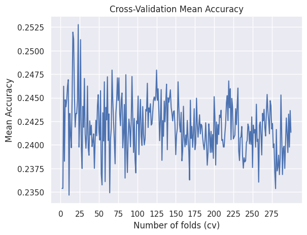

# Report on training 

## First plan comparative analysis 

Dopo aver concluso le precedenti fasi di bussiness understanding, data understanding, data preparation abbiamo finalmente effettuato l'addestramento del modello di classificazione per il task multi-class che ci eravamo preposti dopo aver completato la fase di bussiness e data understanding. L'addestramento è stato ostico e sicuramente non ci aspettavamo dalle analisi iniziali che potesse risultare così complicato come si è riscontrato in corso di effettivo addestramento. Siamo partiti dal voler compiere un analisi comparativa che vedesse a comfronto un modello di classificazione basato su di un albero decisionale, un modello che si basasse sul framework Bayesiano e infine un modello di addestrato tramite il processo dell'ensemble learning, il quale prevede di addestrare più modelli e una volta addestrati utilizzare una funzione di aggregazione capace di sintetizzare i risultati riportati da questi modelli in un unico risultato finale. Quindi il piano di addestramento iniziale prevedeva un'analisi comparativa tra i seguenti 3 modelli:

      1. Decision Tree model C4.5
      2. Gaussin Naive Bayes
      3. Random Forest
     

Con questa idea di partezza abbia utilizzato python 3.0 e la libreria di scikitlearn per importare ed anadare ad addestrare i modelli sopra elencati. Le fasi inizialii di training non si sono concluse con successo i modelli addestrati riportavano scarsi risultati sicuramente risultati che non avrebbeero risolto il problema che ci siamo pre posti. Conseguentemente a risultati di performance scadenti abbiamo deciso di rielaborare il piano iniziale e per prima cosa ci siamo posti di analizzare il **lower bound** del problema, il quale è stato identificato con la moda. In seguito il nostro primo obiettivo è stato quello di riuscire a battere questo stimatore che risulta essere uno stimatore zero-effort che ci viene dato dalla teoria statistica e in seguito in caso di successo avvremmo cercato di definire un **uper bound** con il quale ci saremmo ritenuti soddisfatti per affrontare il problema di classificazione dello stato di fibrosi del frgato di pazienti affetti da HCV. 

  

## Second plan bit the mode estimator

Dopo aver ridefinito il piano di addestramento e gli obiettivi che vogliamo estrarre da questa fase si è proceduto all'addestramento dei seguenti 18 modelli: 

    1. Decision Tree C4.5
    2. Gaussian Naive Bayes
    3. Multinomial Naive Bayes
    4. Bernoulli Naive Bayes
    5. Complement Naive Bayes
    6. Random Forest
    7. Extra Tree Classifier
    8. Ada Boost Classifier
    9. XGBoost Classifier
    10. Gradient Boosting Classifier
    11. Perceptron
    12. Multi Layer Perceptron
    13. Logistic Regression
    14. Ridge Classifier
    15. Linear Support Vector Machine
    16. NuSVC support vector machine con coefficiente nu
    17. SVC support vector machine con coefficiente c
    18. Sthocastic Gradient Descent Classifier

Per ogni uno di questi modelli si è effettuato un addestramento sul dataset di partenza, per ottenere una baseline line del modello preso in considerazione rispetto al problema e in seguito abbiamo addestrato il modello fornendoli i dataset rielaborati a seguito delle ipotesi avanzate durante la data cleaning and reduction. Infine per ogni modello abbiamo eseguito un ottimizzazione sul processo della cross validation per trovare il k numero di fold che permettesse di migliorare l'accurancy del modello, tale processo è stato ripetuto andando ad incrementare il numero di test effettuati e ove non ci sono state limitazione con le risorce computazionali è stata effettuata un ottimizzazione con iterazioni su k incrementale da 2 a 30, 100 e 300. Non ci siamo spinti oltre 300 perchè non avrebbe avuto senso data la cardinalità del dataset a disposizione. Infine questo processo è stato utilizzato per selezionare i migliori modelli sui quali abbiamo effettuato un processo di ottimizzazione dei parametri ed una volta individuati tali parametri siamo passati all'addestramento finale di tali modeli con la loro conseguente valutazione.

### Decision Tree C4.5 training

L'addestramento iniziale dell'albero ha visto una prima tecnica sperimentale con la quale si è voluta valutare la differenza con l'approccio classico che vede la cross validation. In questo esperimento abbiamo diviso il dataset iniziale nelle 2 partizioni per effettuare train e test in particolare è stato scelto un una suddivisione 90:10 ovvero il 90% del dataset è stato dedicato al training set mentre il 10% è stato riservato per il test set. Il motivo di tale suddivisione contro le classiche suddivisioni 70:30, 75:25 o la più spinta 80:20 è dovuto al tipo di valutazione condotta infatti con il training set è stato effettuato un processo di cross validation con 10 fold questo significa che il 90% dell'intero data set è stato partizionato in 10 parti eque e per 10 volte è stato addestrato il modello che vedeva sempre un nuovo trainig set leggermente diverso e un nuovo test set infine su questi modelli è stata calcolata l'accurancy media ed è stata posta a confronto con un single shoot training effettuato con l'intero 90% che era stato usato per la cross validation, mentre per il test è stato usato il 10% che avevamo lascitao da parte. Questo approccio ci aha permesso di mettere a confronto la media della cross validation con un single training su un dataset più grande.In seguito si è utilizzato il classico metodo con una cross validation a 10 folds e questi sono i risultati ottenuti:

  

In seguito si sono effettuati dei test di addestramento e valutazione delle performace sul modello con i principali valori di fold usati nella cross validation presi dalla letteratura scientifica i quali hanno dato i seguenti risultati:

  

Infine riportiamo i risultati ottenuti dall'ottimizzazione dei folds richiesti per la cross vaalidation:

#### Conclusion on Decision Tree

## Training of model based on Bayesian framework
### Gaussian Naive Bayes

  

Riportiamo di seguito i grafici di ottimizzazione della cross validation che visualizzazano l'andamento dell'accurnacy rispetto al numero di fold effettuati:

#### Conclusion on Gaussian Naive Bayes

......

### Multinomial Naive Bayes

  

Riportiamo di seguito i grafici di ottimizzazione della cross validation che visualizzazano l'andamento dell'accurnacy rispetto al numero di fold effettuati:

   

#### Conclusion on Multinomial Naive Bayes 

........

### Bernoulli Naive Bayes

  

Riportiamo di seguito i grafici di ottimizzazione della cross validation che visualizzazano l'andamento dell'accurnacy rispetto al numero di fold effettuati:

   

### Complement Naive Bayes

   

  

Riportiamo di seguito i grafici di ottimizzazione della cross validation che visualizzazano l'andamento dell'accurnacy rispetto al numero di fold effettuati:

#### Conclusion on Complement Naive Bayes

.......

  

## Training of model based on ensemble learning
###  Ensemble model with Bagging strategy
#### Random Forest

  

Riportiamo di seguito i grafici di ottimizzazione della cross validation che visualizzazano l'andamento dell'accurnacy rispetto al numero di fold effettuati:

#### Conclusion on Random Forest

#### Extra Tree

  

Riportiamo di seguito i grafici di ottimizzazione della cross validation che visualizzazano l'andamento dell'accurnacy rispetto al numero di fold effettuati:

#### Conclusion on Extra Tree

### Ensemble model with Boosting strategy
#### Ada Boost

  

Riportiamo di seguito i grafici di ottimizzazione della cross validation che visualizzazano l'andamento dell'accurnacy rispetto al numero di fold effettuati:

#### Conclusion on Ada Boost

#### XGBoost

  

Riportiamo di seguito i grafici di ottimizzazione della cross validation che visualizzazano l'andamento dell'accurnacy rispetto al numero di fold effettuati:

#### Conclusion on XGBoost

#### Gradient Boost Classifier

  

Riportiamo di seguito i grafici di ottimizzazione della cross validation che visualizzazano l'andamento dell'accurnacy rispetto al numero di fold effettuati:

#### Conclusion on Gradient Boost Classifier

13. Logistic Regression
    14. Ridge Classifier
    15. Linear Support Vector Machine
    16. NuSVC support vector machine con coefficiente nu
    17. SVC support vector machine con coefficiente c
    18. Sthocastic Gradient Descent Classifier

## Model based on regression
### Logistic Regression

  

Riportiamo di seguito i grafici di ottimizzazione della cross validation che visualizzazano l'andamento dell'accurnacy rispetto al numero di fold effettuati:

#### Conclusion 

### Ridge Regression

  

Riportiamo di seguito i grafici di ottimizzazione della cross validation che visualizzazano l'andamento dell'accurnacy rispetto al numero di fold effettuati:

#### Conclusion 

## Model based on Support Vector Macchine
### Linear Support Vector Macchine

  

Riportiamo di seguito i grafici di ottimizzazione della cross validation che visualizzazano l'andamento dell'accurnacy rispetto al numero di fold effettuati:

#### Conclusion 

### Nu Support Vectort Macchine or coefficient Nu SVM

  

Riportiamo di seguito i grafici di ottimizzazione della cross validation che visualizzazano l'andamento dell'accurnacy rispetto al numero di fold effettuati:

#### Conclusion 

### Support Vector Macchine coefficient C

  

Riportiamo di seguito i grafici di ottimizzazione della cross validation che visualizzazano l'andamento dell'accurnacy rispetto al numero di fold effettuati:

#### Conclusion 

## Model based on Gradient Descent
### Sthocastic Gradient Descent Classifier

  

Riportiamo di seguito i grafici di ottimizzazione della cross validation che visualizzazano l'andamento dell'accurnacy rispetto al numero di fold effettuati:

Visualizziamo la situazione generale del nostro dataset dei patienti fibrotici per sesso:

