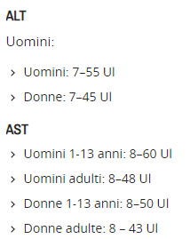
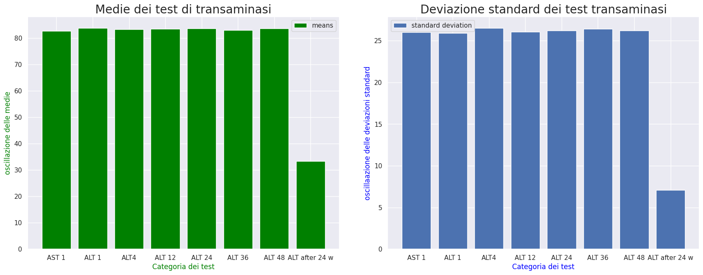

# Report on transaminasis AST and ALT 

Dalla studio della business understand e dalle ricerche nella letterauta scientifica sono emerse importanti considerazioni che vengono raccolte e chiarite tramite dei grafici e delle tabelle di riferimento per analizzare le decisioni che saranno prese nelle operazione di data cleaning e feature reduction che saranno possibilmente utilizzate prima dell'addestramneto e che in seguito saranno dettagliate in un apposito documento. 

Iniziamo descrivendo cosa rappresentano le feature AST e ALT. Questi sono due tipologie di esami clinici ematici che vengono a essere eseguito per monitorare lo stato del fegato e in particolare fungono da marcatori di infiammazione e squilibrio del normale funzionamento epatico. In particolare nella letteraturascientifica questi test prendono il nome dagli enzimi che vanno a misurare nel sangue, Glutammato-ossalacetato transaminasi GOT, detta anche aspartato aminotransferasi AST e
Glutammato-piruvato transaminasi GPT, detta anche alanina aminotransferasi ALT quest'ultima presente in grande concentrazione nelle cellule epatiche spiega il perché nel follow-up di tali pazienti affetti da infezioni di HCV e con problemi di fibrosi tale enzima sia un importante segnalatore e per tali ragioni lo vediamo ripetuto del dataset.

I test vengono ad essere effettuati nel momento il cui il paziente ha il primo contatto con l'azienda sanitaria a causa dei problemi riscontrati a livello di salute dovuti al contagio da parte del virus HCV. Per tali ragioni abbiamo una baseline dove vengono effettuati congiuntamente AST e ALT e in seguito in modo cadenziato viene ad essere ripetuto solamente ALT dopo 4 settimane, dopo 12 settimane, dopo 24 settimane, dopo 36 settimane, dopo 48 settimane a dopo quest'ultimo vi è il follow-up a 24 settimane successive a partire dal test effettuato a 48 settimane dall'inizio del problema e l'inzio del trattamento. Dopo un breve prologo per inqudrare il settore nel quale ci muoviamo passiamo ad analizzare i dati e la loro forma.

  

## Datatype on attributes treated for analysis
|Colonna|Tipo|
|---|---|
|AST 1|int64|
|ALT 1|int64|
|ALT4|float64|
|ALT 12|int64|
|ALT 24|int64|
|ALT 36|int64|
|ALT 48|int64|
|ALT after 24 w|int64|

I dati della proizione estratta riguardanti i test sulle transaminasi sono stati raccolti tutti in formato intero a parte di ALT4 dovuto sicuramente ad un problema di inserimento nella codifica scelta visto che i dati rappresentato tutti lo stesso test ripetuto a distanza di tempo. Lo riportermo nel formato intero congruo  alle altre osservazioni effettuate.

  

## Correlation Matrix

Riportiamo anche in questo report la matrice di correlazione che abbiamo creato tra tutte gli attributi del dataset che abbiamo e partiamo dal fatto che tale matrice non metta in evidenza alcuna correlazione tra questi test ripetuti nel tempo:

Come è possibile notare dall'immagine della matrice non vi è una correlazione tra questi attributi nonostante vi sia un chiaro legame che li lega nel dominio di sttudio, per tali ragioni non vi è evidenza fornitaci da questa matrice, tuttavia è bene fare alcune riflessione anche in questo caso e capire come trattare al meglio questi dati e con l'obiettivo principale di capire se sia possibile aggregarli in un nuovo attributo tramite tecniche di feature engeenering quali PCA e FA al fine di ridurre la complessità del modello che si andrà ad addestrare.

  

## Table of summarization for transaminasis

|index|AST 1|ALT 1|ALT4|ALT 12|ALT 24|ALT 36|ALT 48|ALT after 24 w|
|---|---|---|---|---|---|---|---|---|
|count|1385\.0|1385\.0|1385\.0|1385\.0|1385\.0|1385\.0|1385\.0|1385\.0|
|mean|82\.77472924187725|83\.91624548736462|83\.4057761732852|83\.51046931407942|83\.70902527075812|83\.11768953068592|83\.62960288808664|33\.43826714801444|
|std|25\.99324216760978|25\.922799521394243|26\.52972966705637|26\.06447788401468|26\.205994454785444|26\.399030797129967|26\.223954685295045|7\.073569415669246|
|min|39\.0|39\.0|39\.0|39\.0|39\.0|5\.0|5\.0|5\.0|
|25%|60\.0|62\.0|61\.0|60\.0|61\.0|61\.0|61\.0|28\.0|
|50%|83\.0|83\.0|82\.0|84\.0|83\.0|84\.0|83\.0|34\.0|
|75%|105\.0|106\.0|107\.0|106\.0|107\.0|106\.0|106\.0|40\.0|
|max|128\.0|128\.0|128\.0|128\.0|128\.0|128\.0|128\.0|45\.0|

Il task di summarization ovvero di descrizione della proiezione del dataset sui test delle transaminasi è stato effettuato per capire come questi enzimi a livello ematico si comportino nel tempo e se abbiano una certa relazione con il virus del HCV e le sue prime fasi di contagio del paziente. Oltre alla tabella delle statistiche sono stati prodotti dei file in formato excel che hanno permesso di prendere visione dell'andamento dei dati e della presenza o meno di anomalie da ritenere come possibili errori o outlier. Le analisi condotte hanno rilevato che mediamente questi test e quindi i relativi enzimi che monitorano si mantengono costanti tuttavia è da sottolineare il grosso range di deviazione standard che c'è per AST e ALT sino alla 48-esima settima, mentre sul controllo di follow-up tale varianza si riduce e la media rientra intorno a valori che sono considerati normali come riportato dalla tabella presa da un sito di infermieri italiani.

### Reference table for transaminasis range

L'istogramma mette in luce quanto discusso precedentemente enfatizzando come sia per la media che la deviazione standard subiscano un calo sul ultimo follow-up.

  

## Conclusions

Queste analisi ci hanno portato a capire meglio il dominio nel quale ci stiamo muovendo, ma non solo ci hanno offerto spunti per la riflessione e su come tratteremo tali dati in un possibile approccio con data reduction. Dalle ipotesi formulate comprovate dai grafici e dallo studio dei file excel creati e dalle ricerche fatte in ambito medico a riguardo delle transaminasi ci è stato possibile notare le uniche due anomalie presenti nel dataset i quali riportano entrambi valori al di sotto della tabella di riferiment mostrata un chiaro esempio di qualcosa che sia andato storto nel processo di raccolta di questi dati per i quali utilizzero un SimpleImputer per sovrascrivere queste misurazioni con la media delle rispettive colonne.

  

### Useful links for better understanding transaminasis test 

- [sito degli infermieri italiani dettagli sui test per transaminasi](https://www.nurse24.it/studenti/indagini-diagnostiche/transaminasi-alt-ast-gpt-got.html)

- [valori di riferimento trasaminasi per pazienti con HCV](https://pubmed.ncbi.nlm.nih.gov/12093239/)

- [Common reference intervals for aspartate aminotransferase (AST), alanine aminotransferase (ALT) ](https://pubmed.ncbi.nlm.nih.gov/21034260/)

- [Alterazione delle transaminasi](https://www.informazionisuifarmaci.it/le-alterazioni-delle-transaminasi-1a-parte)